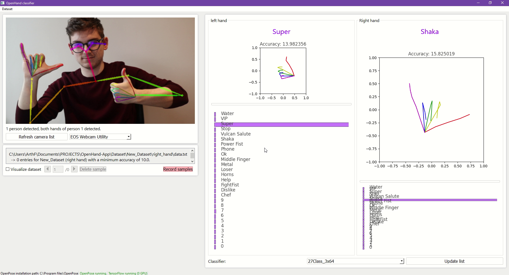
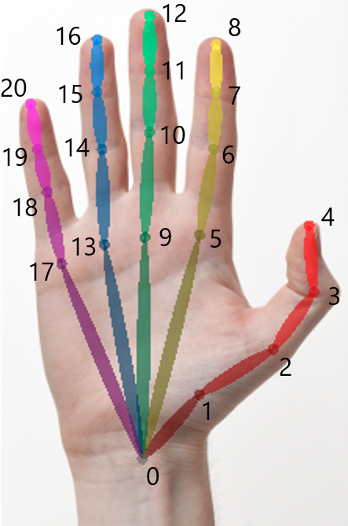
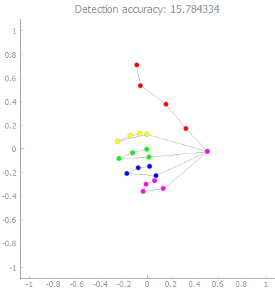

# <h1 align = "center"> OpenHand

[](https://github.com/ArthurFDLR/OpenHand-App/blob/master/pyproject.toml)
[](https://github.com/psf/black)
[](https://github.com/ArthurFDLR/OpenHand-Classifier/blob/master/LICENSE)

<p align="center">
    
</p>

The OpenHand application uses the excellent full-body pose estimator [**OpenPose**](https://github.com/CMU-Perceptual-Computing-Lab/openpose) from **CMU Perceptual Computing Lab** to ease hand keypoints datasets creation and real-time pose classification.

  - [Installation](#installation)
  - [Under the hood](#under-the-hood)
    - [Features extraction](#features-extraction)
    - [Keypoints normalization](#keypoints-normalization)
    - [Dataset creation - *11090 samples for 27 categories*](#dataset-creation---11090-samples-for-27-categories)
    - [Pose classifier models](#pose-classifier-models)
  - [User guide](#user-guide)
    - [Additional scripts](#additional-scripts)

## Installation

Ensure  that [`Poetry`](https://poetry.eustace.io/) is installed for Python 3.7 and above on your system.

1. Git clone the repository - `git clone https://github.com/ArthurFDLR/OpenHand-App`

2. Create an adequate `venv` virtual environment - `python -m poetry install` (or use the configuration file [`.\requirements.txt`](https://github.com/ArthurFDLR/OpenHand-Classifier/blob/master/requirements.txt) in the Python 3.7+ environment of your choice)

3. You should now be able to run the application - `make run` (or `poetry run python .\pose-classification-kit`)

Even if **OpenHand classifier** can run without [**OpenPose**](https://github.com/CMU-Perceptual-Computing-Lab/openpose), it must be installed on your system to allow real-time hand gesture classification.

4.  Follow [OpenPose installation instructions](https://github.com/CMU-Perceptual-Computing-Lab/openpose/blob/master/doc/installation.md).

5. Once the installation is completed, change the variable `OPENPOSE_PATH` ( [`.\pose-classification-kit\__init__.py`](https://github.com/ArthurFDLR/OpenHand-Classifier/blob/master/pose-classification-kit/__init__.py)) to the location of the OpenPose installation folder on your system.

_Note:_ TensorFlow 2.4.0 is installed by default (can be changed through `Poetry`). GPU support thus requires CUDA 11.0, which might conflict with **OpenPose** requirements. However, classification models available in the application are relatively light. Modern CPUs will handle these models' inference process flawlessly.

## Under the hood

### Features extraction

The 21 hand keypoints (2D) used as input for this classifier are produced by OpenPose. The hand output format is as follow:



More information is available [here](https://github.com/CMU-Perceptual-Computing-Lab/openpose/blob/master/doc/output.md#face-and-hands). Please note that even though OpenHand focus on hand keypoints, [OpenPose requires the whole body to be analyzed](https://github.com/CMU-Perceptual-Computing-Lab/openpose/blob/master/doc/standalone_face_or_hand_keypoint_detector.md) to generate hand data. Furthermore, keypoints coordinates are given in the frame of reference of the image fed to OpenPose. Thus, the coordinates have to be normalized.
I addition to x, y coordinates, the accuracy of detection of each keypoints is provided.

### Keypoints normalization

OpenPose outputs have to be formatted and normalized before classification analysis. Coordinates are normalized relative to finger length and the center of gravity of the hand.

* **Scaling:** First, the length of each fingers - defined as a set of lines of the same color, see above - is calculated. The euclidian distances of all segments of a finger are sumed *- e.g.* .
Then, every coordinates composing the hand are divided by the greater finger length.

* **Centering:** Keypoints are centered relative to the center of mass of the hand which, in this case, is simply defined as .

<details><summary>Click to show code</summary>
<p>

```python
handKeypoints = np.array(op.Datum().handKeypoints)[handID, self.personID]

lengthFingers = [np.sqrt((handKeypoints[0,0] - handKeypoints[i,0])**2 + (handKeypoints[0,1] - handKeypoints[i,1])**2) for i in [1,5,9,13,17]] #Initialized with the length of the first segment of each fingers.
for i in range(3): #Add length of other segments for each fingers
    for j in range(len(lengthFingers)):
        lengthFingers[j] += np.sqrt((handKeypoints[1+j*4+i+1, 0] - handKeypoints[1+j*4+i, 0])**2 + (handKeypoints[1+j*4+i+1, 1] - handKeypoints[1+j*4+i, 1])**2)
normMax = max(lengthFingers)

handCenterX = handKeypoints.T[0].sum() / handKeypoints.shape[0]
handCenterY = handKeypoints.T[1].sum() / handKeypoints.shape[0]
outputArray = np.array([(handKeypoints.T[0] - handCenterX)/normMax,
                        -(handKeypoints.T[1] - handCenterY)/normMax,
                        (handKeypoints.T[2])])
```
</p>
</details>



### Dataset creation - [*11090 samples for 27 categories*](https://github.com/ArthurFDLR/OpenHand-Classifier/tree/master/Datasets)

The dataset is composed of several classes consisting of two text files, one for each hand. The dataset is structured as follow:

```
.\AppHandClassifier\Datasets
│
└───class_label_1
│   └───left_hand
│   │       data.txt
│   └───right_hand
│           data.txt
│
└───class_label_2
│   └───left_hand
│   │       data.txt
│   └───right_hand
│           data.txt
.
.
```

The first line of a *data.txt* file contains the set's characteristics:
- Class label
- Hand identifier (0 for the left hand, 1 for the right hand)
- The minimum accuracy of detection

To add comments, begin a line with *##*. A sample is (at least) composed of 3 lines: a header giving the detection accuracy, x coordinates, y coordinates. 

<details><summary>Click to show examples - First lines of 'Super' set for right hand</summary>
<p>

```
Super,1,13.0
## Data generated the 2020-07-28 labelled Super (right hand) with a global accuracy higher than 13.0, based on OpenPose estimation.
## Data format: Coordinates x, y and accuracy of estimation a

#14.064389
x:-0.47471642 -0.38345036 -0.27814367 -0.17283674 -0.16581643 -0.07455035 0.24136995 0.26243138 0.18520646 -0.060509484 0.24136995 0.17116559 0.05883807 -0.095611796 0.22732908 0.14308357 0.030756325 -0.10965267 0.1220224 0.10798126 0.02373602
y:-0.120350584 0.12536536 0.38512218 0.6238177 0.8203904 0.13238579 0.12536536 0.097283475 0.09026304 -0.07822783 -0.043125518 -0.029084647 -0.015043774 -0.2467187 -0.19757552 -0.16247334 -0.14843246 -0.3801074 -0.36606652 -0.30990276 -0.30288246
a:0.4513099 0.52159405 0.73779285 0.7362725 0.8151489 0.8092662 0.74224406 0.4387765 0.23850155 0.797209 0.79372936 0.59578335 0.44275257 0.81076413 0.9635796 0.647649 0.5396069 0.80517197 0.8936012 0.7543843 0.52925146

#15.550782
x:-0.4933955 -0.3817585 -0.23523489 -0.109643176 -0.053824674 0.008971046 0.23224507 0.13456275 0.043857645 0.001993833 0.24619977 0.13456275 0.015948527 -0.025915554 0.22526786 0.113630846 0.001993833 -0.053824674 0.12060806 0.07874425 -0.0049836473
y:-0.113298275 0.13090765 0.36813638 0.5914105 0.779798 0.109975755 0.102998406 0.137885 0.14486235 -0.07841181 -0.06445711 -0.0225933 -0.015615954 -0.23888998 -0.19702616 -0.16213956 -0.16911678 -0.3575045 -0.350527 -0.30168596 -0.2947085
a:0.59823513 0.6402868 0.81965464 0.87657 0.9046949 0.83729064 0.8742925 0.47936943 0.43094704 0.82496655 0.87384015 0.65166384 0.5838103 0.8670102 0.9759184 0.6943432 0.5715823 0.81283325 0.8954963 0.71702033 0.62095624
```

</p>
</details>

Note that a training set of 150 samples per hand and per pose seems enough to yield good classification results. A couple of minutes of recording with the provided tool is enough to generate enough data for a pose.

### Pose classifier models

Classification models available in the application are stored in [`.\Models`](https://github.com/ArthurFDLR/OpenHand-App/tree/master/Models). Each model sub-folder contains two HDF5 files containing the model's architecture and weights values. While both models usually share the same architecture, they are trained to analyze the right or the left hand. Besides, a text file `class.txt` provides labels associated with the classifiers' one-hot encoded output.

```
.\AppHandClassifier\Models
│
└───model_1
|       class.txt
│       model_1_left.h5
|       model_1_right.h5
│
└───model_2
|       class.txt
│       model_2_left.h5
|       model_2_right.h5
.
.
```

See [**OpenHand-Models** repository](https://github.com/ArthurFDLR/OpenHand-Models) for more details about model creation.

## User guide

### Real-time pose classification

The video feed of the selected camera is fed to OpenPose at all times. The analysis results are displayed on the left side of the application. You have to choose one of the available models in the drop-down at the bottom of the hand-analysis window. Hand keypoints extracted from the video feed by OpenPose are automatically normalized and fed to the classifier.

### Create and manipulate datasets

First, you either have to load or create a new set of samples for a specific label and hand side. To do so, respectively choose *Open (Ctrl+O)* or *Create new (Ctrl+N)* in *Dataset* of the menu bar. You have to specify the hand side, the label, and the newly created samples set' accuracy threshold. The accuracy threshold defines the minimum accuracy of hand keypoints detection from OpenPose of any sample in the set. This accuracy is displayed on top of hand keypoints graphs.

Now that a set is loaded in the application, you can record new samples from your video feed or inspect the set and delete inadequate samples. When your done, save the set through *Dataset -> Save (Ctrl+S)*.

### Additional scripts

Some functionalities  are currently unavailable through the GUI:
- You can export all dataset samples from [`.\Dataset`](https://github.com/ArthurFDLR/OpenHand-App/tree/master/Dataset) in a single CSV file - `make dataset-csv` (or `poetry run python .\pose-classification-kit\scripts\dataset_export.py`)
- You can generate videos similar to [this one](https://youtu.be/FK-1G749cIo) ([`.\pose-classification-kit\scripts\video_creation.py`](https://github.com/ArthurFDLR/OpenHand-App/tree/master/pose-classification-kit/scripts/video_creation.py) might need some modification to fit your use case) - `make video-overlay` (or `poetry run python .\pose-classification-kit\scripts\video_creation.py`)